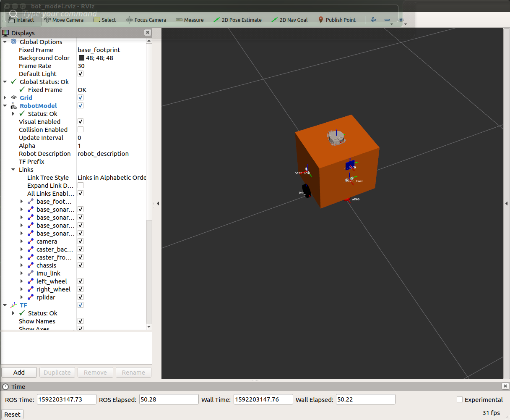
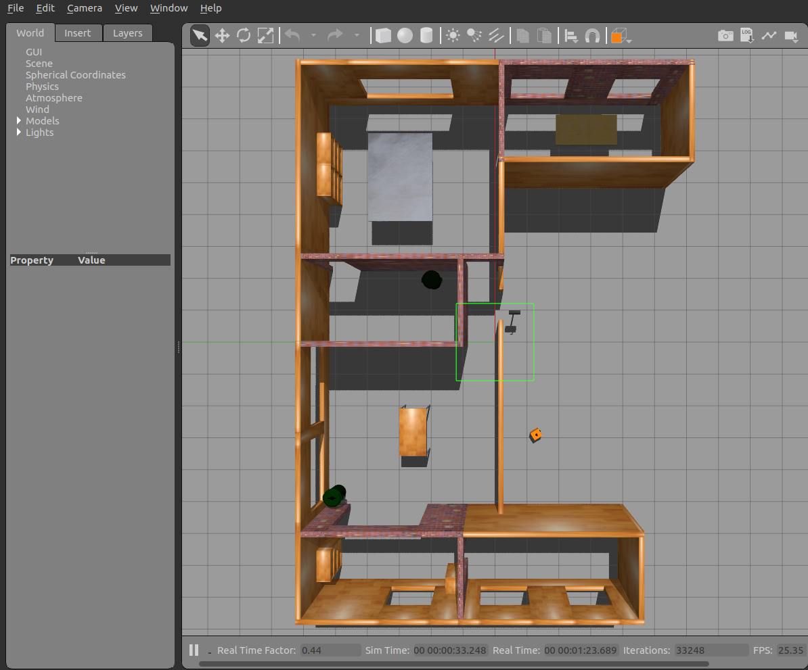
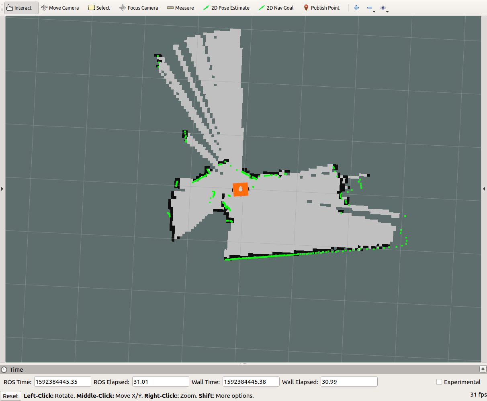

# piya_bot01_ws

## View robot model in rviz
<pre>
roslaunch bot_description bot_rviz.launch
</pre>

## View robot model in gazebo
The most of map models get from [Turtlebot3](https://github.com/ROBOTIS-GIT/turtlebot3)

<pre>
roslaunch piyabot_gazebo house_rviz.launch
</pre>

## Install additional [ROS Control](http://wiki.ros.org/ros_control) package

Install from source 
<pre>
mkdir -p ~/catkin_ws/src
cd ~/catkin_ws/src
git clone https://github.com/ros-controls/urdf_geometry_parser.git
git clone https://github.com/ros-drivers/four_wheel_steering_msgs.git
git clone https://github.com/ros-controls/ros_controllers.git
git clone https://github.com/ros-perception/openslam_gmapping.git
git clone https://github.com/ros-perception/slam_gmapping.git
git clone https://github.com/ros/geometry2.git
git clone https://github.com/ros-planning/navigation.git

cd ~/catkin_ws
catkin_make
catkin_make --install
rsync -r --ignore-existing --include=* install_isolated/ ~/ros_catkin_ws/install_isolated/
</pre>

## Install rpilidar
I use [Slamtec rpilidar](https://github.com/Slamtec/rplidar_ros.git)

<pre>
cd ~/piya_bot01_ws/src/piyabot
git clone https://github.com/Slamtec/rplidar_ros.git
cd cd ~/piya_bot01_ws
catkin_make
#TEST
source devel_isolated/setup.sh
roslaunch rplidar_ros view_rplidar.launch
</pre>

## Gmapping test
<pre>
roslaunch bot_bringup jetson_slam.launch
</pre>

## Install rosbridge_suite
<pre>
sudo apt install -y python3-openssl python3-bson
sudo apt install -y ros-melodic-dwa-local-planner

pip3 install --user autobahn twisted
cd ~/catkin_ws/src
git clone https://github.com/GT-RAIL/rosauth.git
git clone https://github.com/RobotWebTools/rosbridge_suite.git
git clone https://github.com/RobotWebTools/tf2_web_republisher.git
git clone https://github.com/RobotWebTools/robot_web_tools.git
git clone https://github.com/RobotWebTools/web_video_server.git
git clone https://github.com/RobotWebTools/depthcloud_encoder.git
git clone https://github.com/GT-RAIL/async_web_server_cpp.git

cd ~/catkin_ws
catkin_make
catkin_make --install
rsync -r --ignore-existing --include=* install_isolated/ ~/ros_catkin_ws/install_isolated/
</pre>
